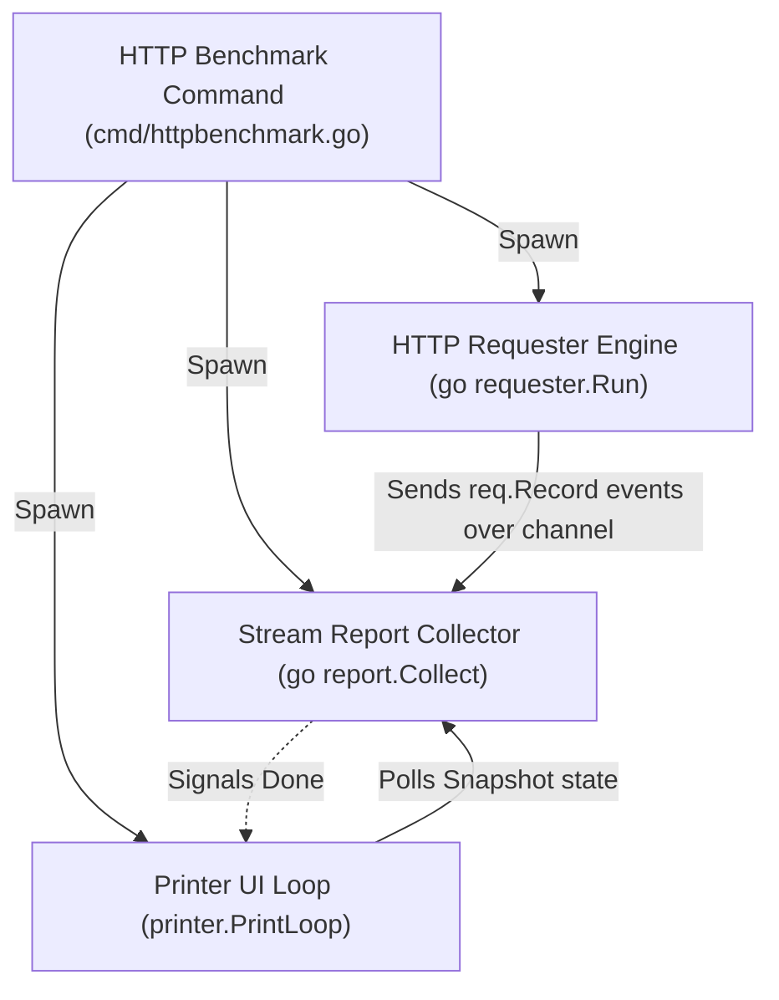
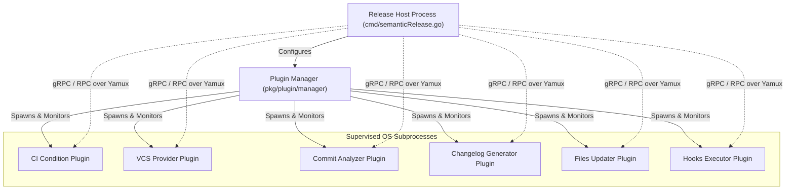

# Agents & Concurrency Architecture

This document describes the logical agents, background processes, concurrent systems, and external plugin supervisors active within the `gsmlg-cli` ecosystem.

## 1. Agent Registry

| Logical Entity | Implementation Module | Lifecycle | Role / Description |
| :--- | :--- | :--- | :--- |
| **HTTP Requester** | `github.com/gsmlg-dev/gsmlg-golang/req.Requester` | Temporary | Sends concurrent HTTP requests to a target URL, emitting metrics. |
| **Stream Report Collector** | `github.com/gsmlg-dev/gsmlg-golang/req.StreamReport` | Temporary | Receives, aggregates, and stores live performance metrics from the Requester. |
| **Terminal Printer** | `github.com/gsmlg-dev/gsmlg-golang/req.Printer` | Temporary | Renders real-time metrics progress bar and terminal tables. |
| **Semantic Release Orchestrator** | `github.com/gsmlg-dev/gsmlg-cli/cmd` (`semanticReleaseCmdHandler`) | Temporary | Coordinates the release pipeline; acts as supervisor to external plugins. |
| **Plugin Subprocess** (Generic) | `github.com/hashicorp/go-plugin.Client` | Transient | Supervised external processes performing specialized release tasks (e.g., git provider, changelog). |
| **Route53 Command Client** | `github.com/gsmlg-dev/gsmlg-cli/cmd` (`route53Cmd`) | Temporary | Interacts with AWS Route53 cloud services using configured credentials. |
| **Cloudflare Command Client** | `github.com/gsmlg-dev/gsmlg-cli/cmd` (`cloudflareCmd`) | Temporary | Interacts with Cloudflare APIs using configured credentials. |
| **OPNsense Command Client** | `github.com/gsmlg-dev/gsmlg-cli/cmd` (`opnsenseCmd`) | Temporary | Interacts with OPNsense router management APIs. |

## 2. State & Transformations

In accordance with functional programming paradigms, agents are modeled as state-holding processes that transition their state by responding to messages/events over channels, rather than mutating object-oriented state fields.

### HTTP Benchmarking Engine
- **State Structure**:
  - `req.Requester`: Holds the request configuration (`req.ClientOpt`), target concurrency size (`int`), and remaining requests (`int64`).
  - `req.StreamReport`: Accumulates a map of status code frequencies (`map[string]int`), latency distributions, and total throughput metrics.
- **Transformations**:
  - `req.NewRequester`: Initializes the worker state pool.
  - `req.Requester.Run`: Spawns concurrent worker goroutines that send HTTP requests. It acts as a state generator, emitting raw metric records to the result channel.
  - `req.StreamReport.Collect`: Listens to incoming metric records over `req.Requester.RecordChan()`, transforming the previous aggregated report state with each new data point.
  - `req.StreamReport.Snapshot`: Returns a read-only view of the aggregated metrics state.

### Semantic Release Supervision Tree
- **State Structure**:
  - `go-semantic-release/pkg/config.Config`: Contains CLI execution flags, target paths, and dry-run toggles.
  - `semrel.Release` and `semrel.Commit`: Holds parsed historical VCS states used to compute version transitions.
- **Transformations**:
  - `manager.New`: Configures and initializes the HashiCorp `go-plugin` manager state.
  - `semrel.GetNewVersion`: Pure functional state transition mapping input commits and the current release state to the next semantic version string.
  - `updater.Apply`: Transforms targeted files on disk to reflect the updated release version.

### AWS Route53 Client
- **State Structure**:
  - Configured AWS credentials (`aws.access_key_id`, `aws.secret_access_key`, and `aws.region`) are persisted in `$HOME/.config/gsmlg/cli.yaml` and loaded into the Viper runtime memory.
- **Transformations**:
  - `viper.Set`: Transitions local config when updated via `route53 config`.
  - `route53.NewFromConfig`: Instantiates a stateful Route53 client using configured credentials or environment variables.

### Cloudflare Client
- **State Structure**:
  - Cloudflare credentials (`cloudflare.token` or `cloudflare.email` and `cloudflare.key`) are stored in `$HOME/.config/gsmlg/cli.yaml` and loaded into Viper memory.
- **Transformations**:
  - `viper.Set`: Transitions local config when updated via `cloudflare config`.
  - `cloudflare.NewWithAPIToken` / `cloudflare.New`: Instantiates a stateful Cloudflare API client session.

## 3. Orchestration & Topology

### HTTP Benchmark Topology
The benchmark system operates with three concurrent processes linked together by Go channels.

### Semantic Release Plugin Supervision Tree
The host process supervises external plugin subprocesses launched via HashiCorp `go-plugin`. The communication channel relies on a multiplexed connection (Yamux) over stdin/stdout.

## 4. Fault Tolerance

- **Goroutine Isolation**: The HTTP Requester's worker goroutines run independently. If an HTTP request fails, times out, or encounters a TLS verification issue, the error is captured and formatted as a `req.Record` failure rather than panicking. The worker process continues executing subsequent requests.
- **Plugin Process Cleanup**: Under `cmd/semanticRelease.go`, signal trapping (`signal.Notify`) listens for `os.Interrupt` and `syscall.SIGTERM`. On intercept, the host executes its `exitHandler` to invoke `pluginManager.Stop()`, which terminates all child subprocesses cleanly, preventing orphaned zombie processes.
- **Graceful Command Termination**: If a command-level failure occurs, the custom error handler `errorhandler.CreateExitIfError` handles system cleanup and triggers `os.Exit` with the corresponding exit code (e.g., exit code 65 for no-change conditions in non-dry-runs).

## 5. Capabilities (Tooling)

Logical entities in `gsmlg-cli` have access to the following APIs, system capabilities, and credentials:

| Entity | Allowed Functions / Resources | Security Context / Credentials |
| :--- | :--- | :--- |
| **Route53 Client** | `ListHostedZones`, `CreateHostedZone`, `DeleteHostedZone`, `ListResourceRecordSets`, `ChangeResourceRecordSets` | Uses AWS credentials stored under `aws.*` in `cli.yaml` or read from environment. |
| **Cloudflare Client** | `ListZones`, `CreateZone`, `DeleteZone`, `ListDNSRecords`, `CreateDNSRecord`, `DeleteDNSRecord` | Uses credentials stored under `cloudflare.*` in `cli.yaml` or read from environment. |
| **OPNsense Client** | Reconfigures and queries external OPNsense routers. | Reads API credentials and base URL from `opnsense.token` and `opnsense.server_url` in `cli.yaml`. |
| **Blog Client** | `blog.Fetch`, `blog.FetchOne` | Fetches public blog feeds from `gsmlg.com` without authentication. |
| **HTTP Benchmark** | `req.NewRequester`, `req.NewStreamReport`, `req.NewPrinter` | Bounded resource usage via flags (`--concurrency`, `--timeout`, `--dial-timeout`). |
